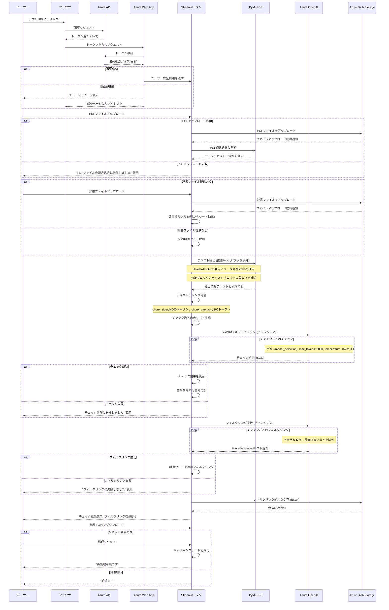

```mermaid
sequenceDiagram
    participant User as ユーザー
    participant Browser as ブラウザ
    participant AzureAD as Azure AD
    participant AzureWebApp as Azure Web App
    participant Streamlit as Streamlitアプリ
    participant PDFLib as PyMuPDF
    participant OpenAI as Azure OpenAI
    participant BlobStorage as Azure Blob Storage

    %% **Azure AD 認証フロー**
    User->>Browser: アプリURLにアクセス
    Browser->>AzureAD: 認証リクエスト
    AzureAD-->>Browser: トークン返却 (JWT)
    Browser->>AzureWebApp: トークンを含むリクエスト
    AzureWebApp->>AzureAD: トークン検証
    AzureAD-->>AzureWebApp: 検証結果 (成功/失敗)
    alt 認証成功
        AzureWebApp->>Streamlit: ユーザー認証情報を渡す
    else 認証失敗
        AzureWebApp-->>User: エラーメッセージ表示
        AzureWebApp-->>Browser: 認証ページにリダイレクト
    end

    %% **Blob Storage を使用したファイルアップロード**
    User->>Streamlit: PDFファイルアップロード
    alt PDFアップロード成功
        Streamlit->>BlobStorage: PDFファイルをアップロード
        BlobStorage-->>Streamlit: ファイルアップロード成功通知
        Streamlit->>PDFLib: PDF読み込みと解析
        PDFLib-->>Streamlit: ページテキスト・情報を返す
    else PDFアップロード失敗
        Streamlit-->>User: "PDFファイルの読み込みに失敗しました" 表示
    end

    %% **辞書ファイルのBlob Storage保存**
    alt 辞書ファイル提供あり
        User->>Streamlit: 辞書ファイルアップロード
        Streamlit->>BlobStorage: 辞書ファイルをアップロード
        BlobStorage-->>Streamlit: ファイルアップロード成功通知
        Streamlit->>Streamlit: 辞書読み込み (A列からワード抽出)
    else 辞書ファイル提供なし
        Streamlit->>Streamlit: 空の辞書セット使用
    end

    %% テキスト抽出処理
    Streamlit->>PDFLib: テキスト抽出 (画像/ヘッダ/フッタ除外)
    Note over Streamlit,PDFLib: Header/Footerの判定にページ高さの5%を使用
    Note over Streamlit,PDFLib: 画像ブロックとテキストブロックの重なりを排除
    PDFLib-->>Streamlit: 抽出済みテキストと処理時間

    %% チャンク分割
    Streamlit->>Streamlit: テキストチャンク分割
    Note over Streamlit: chunk_sizeは4000トークン、chunk_overlapは100トークン
    Streamlit-->>Streamlit: チャンク数と内容リスト生成

    %% チェック処理
    Streamlit->>OpenAI: 非同期テキストチェック (チャンクごと)
    loop チャンクごとのチェック
        Note over OpenAI: モデル: {model_selection}, max_tokens: 2000, temperature: 0または1
        OpenAI-->>Streamlit: チェック結果(JSON)
    end
    alt チェック成功
        Streamlit->>Streamlit: チェック結果を統合
        Streamlit->>Streamlit: 重複削除と行番号付加
    else チェック失敗
        Streamlit-->>User: "チェック処理に失敗しました" 表示
    end

    %% フィルタリング処理
    Streamlit->>OpenAI: フィルタリング実行 (チャンクごと)
    loop チャンクごとのフィルタリング
        Note over OpenAI: 不自然な改行、長音符違いなどを除外
        OpenAI-->>Streamlit: filtered/excludedリスト返却
    end
    alt フィルタリング成功
        Streamlit->>Streamlit: 辞書ワードで追加フィルタリング
    else フィルタリング失敗
        Streamlit-->>User: "フィルタリングに失敗しました" 表示
    end

    %% **Blob Storage にフィルタリング結果を保存**
    Streamlit->>BlobStorage: フィルタリング結果を保存 (Excel)
    BlobStorage-->>Streamlit: 保存成功通知
    Streamlit-->>User: チェック結果表示 (フィルタリング後/除外)
    User->>Streamlit: 結果Excelをダウンロード

    %% リセット処理
    alt リセット要求あり
        User->>Streamlit: 処理リセット
        Streamlit->>Streamlit: セッションステート初期化
        Streamlit-->>User: "再処理可能です"
    else 処理続行
        Streamlit-->>User: "処理完了"
    end

```
