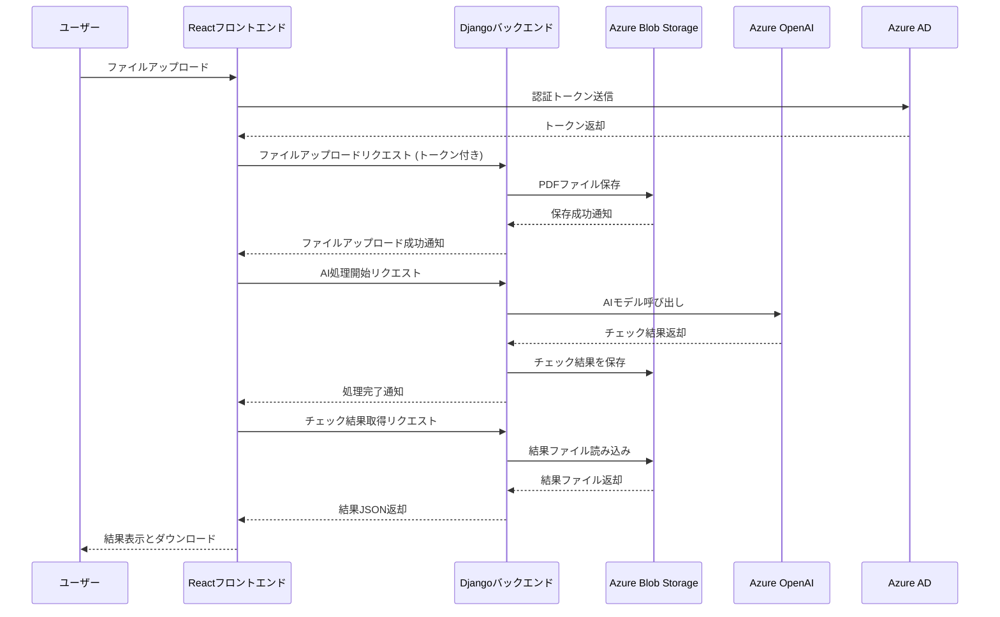

```mermaid
sequenceDiagram
    participant User as ユーザー
    participant React as Reactフロントエンド
    participant Django as Djangoバックエンド
    participant Blob as Azure Blob Storage
    participant OpenAI as Azure OpenAI
    participant AzureAD as Azure AD

    User->>React: ファイルアップロード
    React->>AzureAD: 認証トークン送信
    AzureAD-->>React: トークン返却
    React->>Django: ファイルアップロードリクエスト (トークン付き)
    Django->>Blob: PDFファイル保存
    Blob-->>Django: 保存成功通知
    Django-->>React: ファイルアップロード成功通知

    React->>Django: AI処理開始リクエスト
    Django->>OpenAI: AIモデル呼び出し
    OpenAI-->>Django: チェック結果返却
    Django->>Blob: チェック結果を保存
    Django-->>React: 処理完了通知

    React->>Django: チェック結果取得リクエスト
    Django->>Blob: 結果ファイル読み込み
    Blob-->>Django: 結果ファイル返却
    Django-->>React: 結果JSON返却
    React-->>User: 結果表示とダウンロード

```